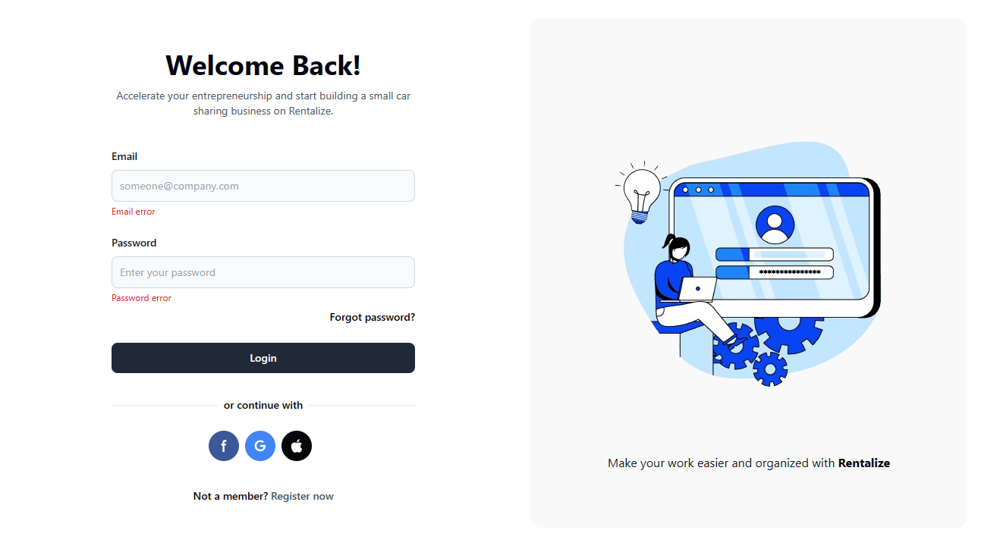

# Login Page - Tailwindcss

Simple login page created only using tailwind css. (Flowbite components are also used but dont need to include since they are also html elements with tailwind classes.)

#### Start development

```bash
npm run dev
```

#### Start build

```bash
npm run build
```